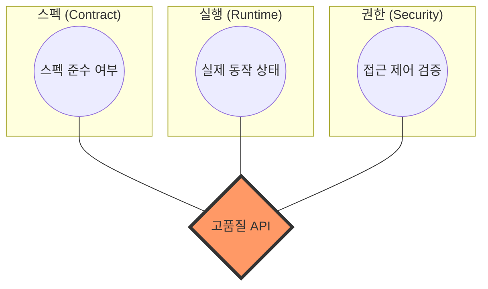

# openapi-auditor

[](https://www.npmjs.com/package/openapi-auditor)
[](https://opensource.org/licenses/MIT)

> **API를 위한 자동화된 진단과 처방.**  
> 모든 OpenAPI(Swagger) 엔드포인트를 전수 조사하고, 실패 원인을 P0~P3 우선순위로 분류하며, 수정 가이드가 포함된 전문가 수준의 리포트를 생성합니다.

---

## ⚡ 빠른 시작 (Quick Start)

1분 안에 시작하세요.

### 1. 설치

```bash
npm install -D openapi-auditor
```

### 2. 초기화

```bash
npx openapi-auditor init
```

루트에 `api-quality-config.json` 설정 파일이 생성됩니다.

### 3. 진단 실행

```bash
npx openapi-auditor run --openapi ./openapi.json --baseUrl http://localhost:3000
```

### 4. 리포트 확인

`./reports/REPORT.md` 파일을 열어 진단 결과를 확인하세요.

---

## ✨ 핵심 기능

- **전수 자동화(Automated Audit)**: OpenAPI 스펙에 정의된 모든 엔드포인트를 누락 없이 테스트합니다.
- **지능형 페이로드 생성**: 스키마를 분석하여 유효한 테스트 데이터를 자동으로 생성합니다.
- **권한 기반 테스트**: ADMIN, OPERATOR, READONLY 등 역할별 접근 제어를 검증합니다.
- **진단 및 가이드**: 단순 실패(Fail)를 넘어 '원인'과 '수정 방향'을 P0~P3 우선순위와 함께 제시합니다.
- **전문가급 리포트**: 통계와 리스크 분석이 포함된 전문적인 `REPORT.md`를 생성합니다.

## 📊 왜 openapi-auditor인가요?

"Auditor"는 **계약 테스트(Contract Test)**, **런타임 검증(Runtime Validation)**, **보안 감사(Security Auditing)**의 교집합에 위치합니다.



*교집합 영역은 `openapi-auditor`가 보장하는 고품질의 API 환경을 의미합니다.*

---

## 📄 문서 (Documentation)

- [English (EN)](./README.md) / [Details](./docs/en/getting-started.md)
- [한국어 (KO)](./docs/ko/getting-started.md)

## 🛠 최소 설정 예시

```json
{
  "openapi": "./openapi.json",
  "baseUrl": "http://localhost:3000",
  "timeout": 5000,
  "outputDir": "./reports"
}
```

## ⚠️ 지원 버전 및 제약 사항

- **OpenAPI**: 3.0.x (전체 지원), 2.0 (제한적 지원)
- **인증**: Role 기반 JWT 방식을 권장합니다.
- **제약**: 복잡한 상태 의존적인 흐름(예: A 생성 후 B 조회)은 스펙의 example 데이터가 충분히 정의되어야 유연하게 동작합니다.

## 🤝 기여하기

[CONTRIBUTING.ko.md](./CONTRIBUTING.ko.md)를 참고하세요.

## 🛡️ 보안 정책

[SECURITY.ko.md](./SECURITY.ko.md)를 참고하세요.

## 📄 라이선스

[MIT](./LICENSE)
