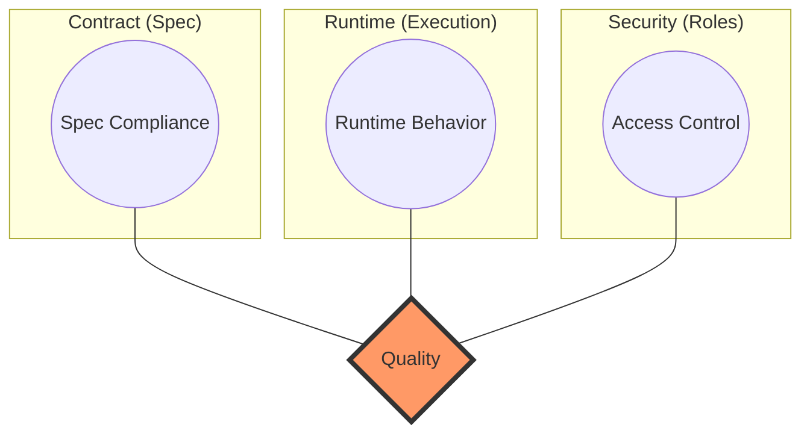

# openapi-auditor

[](https://www.npmjs.com/package/openapi-auditor)
[](https://opensource.org/licenses/MIT)

> **Diagnosis and Prescription for Your APIs.**  
> Automatically audit all OpenAPI (Swagger) endpoints, classify failures by priority (P0-P3), and generate expert-level reports with fix guidance.

---

## ⚡ Quick Start

Get started in less than a minute.

### 1. Install
```bash
npm install -D openapi-auditor
```

### 2. Initialize
```bash
npx openapi-auditor init
```
This creates `api-quality-config.json` in your root.

### 3. Run Audit
```bash
npx openapi-auditor run --openapi ./openapi.json --baseUrl http://localhost:3000
```

### 4. Check Report
Open `./reports/REPORT.md` to see the diagnosis results.

---

## ✨ Key Features

- **Automated Audit**: Full coverage of all endpoints defined in your OpenAPI spec.
- **Intelligent Payload Generation**: Automatically generates valid test data based on schemas.
- **Role-Based Testing**: Validates security by testing with different access roles (ADMIN, OPERATOR, READONLY).
- **Diagnosis & Guidance**: Not just 'fail', but 'why' and 'how to fix' with P0-P3 prioritization.
- **Expert Reports**: Generates professional `REPORT.md` with statistics and risk analysis.

## 📊 Why openapi-auditor?

The "Auditor" sits at the intersection of **Contract Testing**, **Runtime Validation**, and **Security Auditing**.



*The overlapping area represents the high-quality API environment that `openapi-auditor` ensures.*

---

## 📄 Documentation

- [English (EN)](./docs/en/getting-started.md)
- [한국어 (KO)](./README.ko.md) / [상세 문서](./docs/ko/getting-started.md)

## 🛠 Minimal Configuration

```json
{
  "openapi": "./openapi.json",
  "baseUrl": "http://localhost:3000",
  "timeout": 5000,
  "outputDir": "./reports"
}
```

## ⚠️ Supported Versions & Limitations

- **OpenAPI**: 3.0.x (Full support), 2.0 (Limited)
- **Authentication**: Role-based JWT is preferred.
- **Limitations**: Complex state-dependent flows (e.g., A must be created before B) require tailored data in the spec examples.

## 🤝 Contributing

See [CONTRIBUTING.md](./CONTRIBUTING.md).

## 🛡️ Security

See [SECURITY.md](./SECURITY.md).

## 📄 License

[MIT](./LICENSE)
