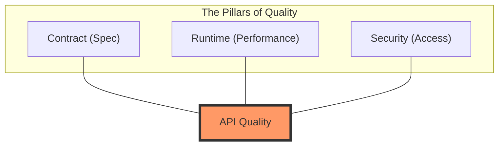
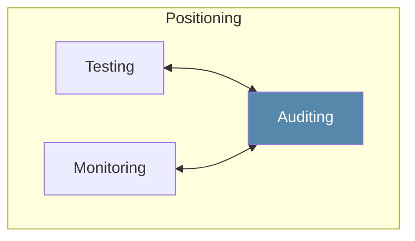
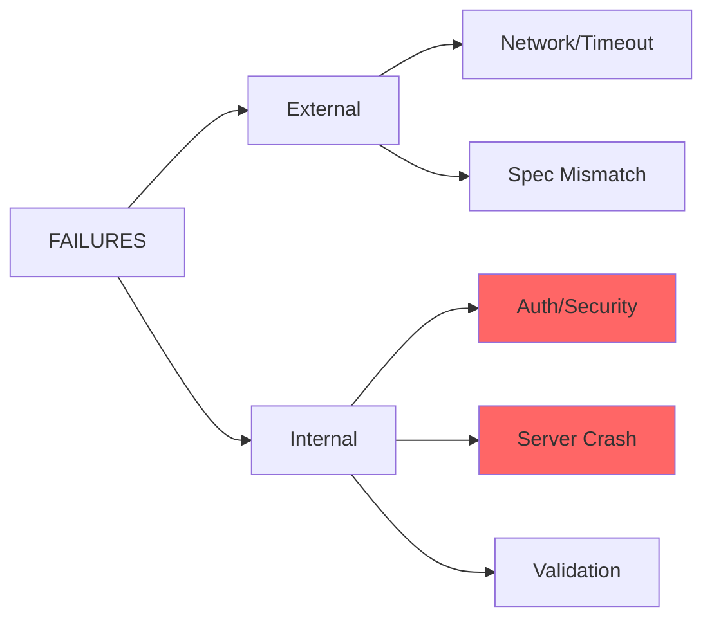

# Visualizing API Quality

These diagrams illustrate the core philosophy behind `openapi-auditor`.

## 1. Defining API Quality
API Quality is not just about "not crashing"; it's the intersection of a solid contract, smooth runtime, and tight security.

## 2. Positioning: Audit vs. Testing
While Testing looks for expected pass/fail, and Monitoring looks for general health, an **Auditor** cross-references the spec against runtime behavior for deeper structural insights.

## 3. Failure Classification Map
The relationship between different error types and how they impact the overall system health.

---

- [Diagnosis Model](./diagnosis-model.md)
- [Getting Started](./getting-started.md)
