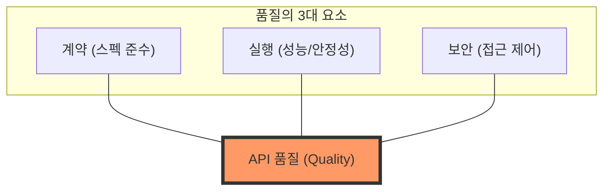
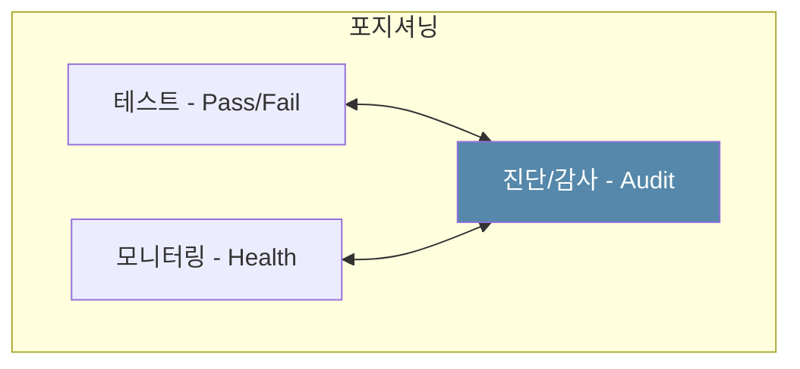
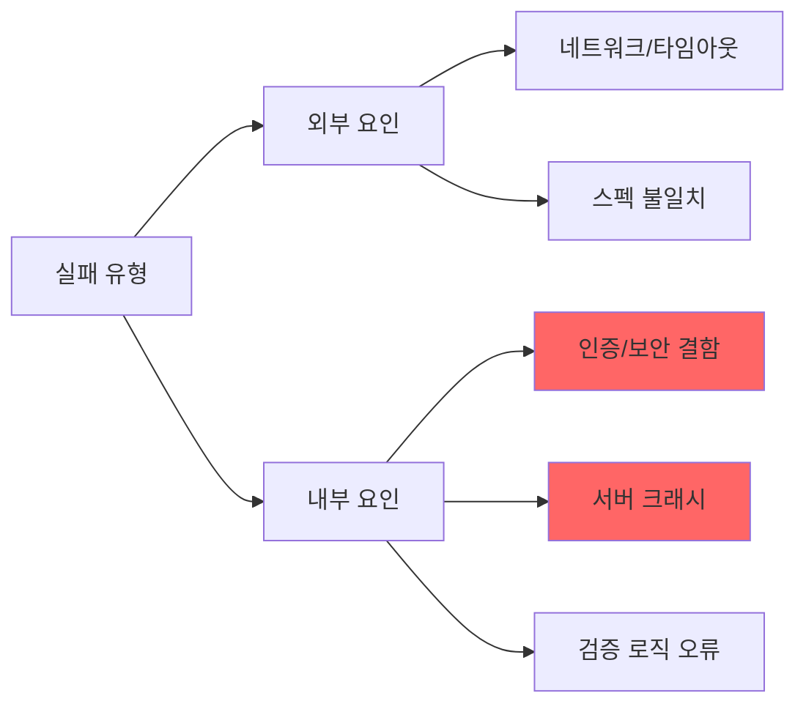

# 시각화 데이터 (Diagrams)

`openapi-auditor`가 추구하는 핵심 가치를 다이어그램으로 설명합니다.

## 1. API 품질의 정의
API 품질은 단순히 "죽지 않는 것"이 아닙니다. 탄탄한 계약(Contract), 원활한 실행(Runtime), 그리고 빈틈없는 보안(Security)의 교집합입니다.

## 2. 포지셔닝: 테스트 vs 모니터링 vs 감사(Audit)
테스트가 기대치(Pass/Fail)를 확인하고 모니터링이 일반적인 생존 상태를 본다면, **진단 도구(Auditor)**는 스펙과 실제 동작을 교차 대조하여 구조적인 통찰을 제공합니다.

## 3. 실패 분류 맵
다양한 에러 유형 간의 관계와 이들이 시스템 건강에 미치는 영향을 보여줍니다.

---

- [진단 모델](./diagnosis-model.md)
- [시작하기](./getting-started.md)
